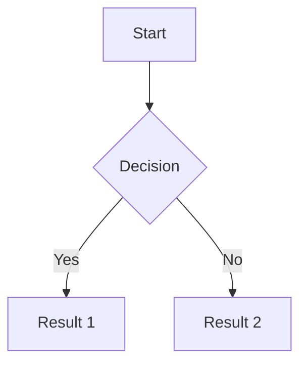

# Obsidian Markdown Guide for Claude

## Basic Markdown

### Headers
```
# H1
## H2
### H3
#### H4
##### H5
###### H6
```

### Text Formatting
- **Bold**: `**text**` or `__text__`
- *Italic*: `*text*` or `_text_`
- ~~Strikethrough~~: `~~text~~`
- ==Highlight==: `==text==`
- `Inline code`: `` `code` ``

### Lists
```
- Unordered item
- Another item
  - Nested item

1. Ordered item
2. Another item
   1. Nested numbered
```

### Blockquotes
```
> This is a quote
> Multiple lines
>> Nested quote
```

### Code Blocks
````
```language
code here
```
````

### Horizontal Rule
```
---
***
___
```

---

## Obsidian-Specific Features

### Internal Links
```
[[Note Name]]                    - Link to another note
[[Note Name|Display Text]]       - Link with custom display text
[[Note Name#Heading]]            - Link to specific heading
[[Note Name#^block-id]]          - Link to specific block
[[Note Name#Heading|Display]]    - Heading link with display text
```

### Embeds
```
![[Note Name]]                   - Embed entire note
![[Note Name#Heading]]           - Embed specific section
![[Image.png]]                   - Embed image
![[Image.png|100]]               - Embed image with width 100px
![[Image.png|100x200]]           - Embed with width x height
![[audio.mp3]]                   - Embed audio
![[video.mp4]]                   - Embed video
![[document.pdf]]                - Embed PDF
![[document.pdf#page=3]]         - Embed PDF at specific page
```

### Block References
```
This is a block ^block-id        - Create block ID
[[Note#^block-id]]               - Reference the block
![[Note#^block-id]]              - Embed the block
```

### Tags
```
#tag
#nested/tag
#tag-with-dashes
```

### Frontmatter (YAML)
```yaml
---
title: Note Title
date: 2024-01-15
tags: [tag1, tag2]
aliases: [alternate name, another alias]
cssclass: custom-class
---
```

### Comments
```
%%This is a comment that won't render%%

%%
Multi-line
comment
%%
```

### Callouts
```
> [!note]
> This is a note callout

> [!warning]
> Warning message

> [!tip]
> Helpful tip

> [!info]
> Information

> [!question]
> A question

> [!danger]
> Danger alert

> [!example]
> Example content

> [!quote]
> A quote

> [!abstract]
> Summary/abstract

> [!todo]
> Task to do

> [!success]
> Success message

> [!failure]
> Failure message

> [!bug]
> Bug report
```

#### Foldable Callouts
```
> [!note]+ Expanded by default
> Content here

> [!note]- Collapsed by default
> Content here
```

#### Custom Callout Titles
```
> [!tip] Custom Title Here
> Content with custom title
```

### Tasks / Checkboxes
```
- [ ] Unchecked task
- [x] Completed task
- [/] In progress (with plugin)
- [-] Cancelled (with plugin)
```

### Tables
```
| Header 1 | Header 2 | Header 3 |
|----------|:--------:|---------:|
| Left     | Center   | Right    |
| aligned  | aligned  | aligned  |
```

### Footnotes
```
Here is a footnote reference[^1]

[^1]: This is the footnote content.

Inline footnote^[This is inline footnote text]
```

### Math (LaTeX)
```
Inline: $E = mc^2$

Block:
$$
\frac{n!}{k!(n-k)!} = \binom{n}{k}
$$
```

### Mermaid Diagrams
````

````

### Dataview Queries (Plugin)
````
```dataview
LIST FROM #tag
WHERE file.mtime >= date(today) - dur(7 days)
SORT file.mtime DESC
```

```dataview
TABLE file.ctime as Created, file.mtime as Modified
FROM "folder"
SORT file.mtime DESC
```
````

---

## File Organization

### Folder Structure
- Use folders for broad categories
- Use links and tags for cross-referencing
- Consider MOCs (Maps of Content) for navigation

### Naming Conventions
- Use descriptive names
- Avoid special characters: `* " \ / < > : | ?`
- Consider date prefixes for journals: `2024-01-15 Daily Note`

---

## Useful Patterns

### Daily Notes Template
```markdown
# {{date}}

## Tasks
- [ ]

## Notes


## Links
- [[Previous Day]]
- [[Next Day]]
```

### MOC (Map of Content)
```markdown
# Topic MOC

## Overview
Brief description of this topic area.

## Core Concepts
- [[Concept 1]]
- [[Concept 2]]

## Related Topics
- [[Related MOC 1]]
- [[Related MOC 2]]
```

### Zettelkasten Note
```markdown
# Note Title

Brief atomic idea here.

## References
- [[Source Note]]

## Related
- [[Related Idea 1]]
- [[Related Idea 2]]
```

---

## MTG Card Template

```markdown
---
tags:
  - card
type: [Creature/Sorcery/Instant/Enchantment/Artifact/Land/Planeswalker]
subtype: [Subtype if applicable, e.g., "Golem Mer-Ikan" or "Saga"]
color: [Single color: White/Blue/Black/Red/Green/Colorless OR array for multicolor]
mana_cost: "{X}{W}{U}{B}{R}{G}"
cmc: [number]
rarity: [Common/Uncommon/Rare/Mythic]
power: [number or *] (creatures and vehicles only)
toughness: [number or *] (creatures and vehicles only)
set: Mirrodin Manifest
---

# Card Name

## Card Type Line
[Type — Subtype]

## Rules Text
> Card rules text here.
> Use line breaks for separate abilities.

## Flavor Text
> *"Flavor text in italics"*

## Image Prompt
> Detailed prompt for AI image generation. Include:
> - Subject/scene description
> - Art style (MTG card art, digital painting, etc.)
> - Color palette matching card color identity
> - Mood/atmosphere
> - Mirrodin Manifest setting elements (metal planes, chrome, artifice)

## Design Notes
- Mechanics used: [[Mechanic Link]]
- Balance considerations
- Lore connections: [[Lore]]
```

### Frontmatter Field Notes

- **color**: Use a single string for mono-colored/colorless cards (`color: Blue`). For multicolor cards, use an array:
  ```yaml
  color:
    - White
    - Black
  ```
- **subtype**: Omit this field entirely if the card has no subtype. Do not use empty string.
- **power/toughness**: Include for creatures AND vehicles. Always in frontmatter, not as a section.

### Mana Symbols Reference
- `{W}` White
- `{U}` Blue
- `{B}` Black
- `{R}` Red
- `{G}` Green
- `{C}` Colorless
- `{X}` Variable
- `{1}`, `{2}`, etc. Generic mana

### Set-Specific Tokens

Use the `#token` tag for token cards.

#### Gold Token ([[Gold Token]])
> **Token — Artifact — Gold**
>
> Gold tokens enter the battlefield with a value counter on them.
>
> *"Sacrifice this artifact: Add {C} for each value counter on this artifact."*

**Design Notes:**
- Gold tokens synergize with counter-doubling effects like [[Hype Cycle]]
- Can be "invested" in by adding counters before cashing out
- Represents the Aurum Surge / Glimmervoid Rally from [[Lore]]
- More complex than Treasure tokens but enables economic gameplay

---

## Tips for Claude

1. **Always use wiki-links** (`[[]]`) for internal references, not markdown links
2. **Check for existing notes** before creating new ones to maintain connections
3. **Use tags consistently** following the vault's existing tag taxonomy
4. **Preserve frontmatter** when editing existing notes
5. **Use callouts** for important information that should stand out
6. **Create bidirectional links** when relevant to strengthen the knowledge graph
7. **Respect folder structure** - place new notes in appropriate folders
8. **For cards**: Always use the card template, link to [[Lore]] and relevant mechanics
